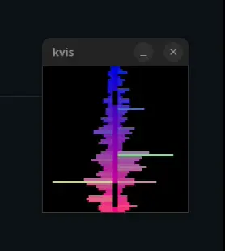

# Coffee Music Visualizer
A small GUI + TUI music visualizer written in Rust.

## About this project
I decided to write the visualizer because existing projects didn't suit me.
Some too slow, some didn't have the visualizer I like, some take up too much cpu usage, etc.

This project also serves as my playground, so you'll see a lot of weird implementations in the source files.

## Examples:




## Platform support
Coffeevis is built for and runs on Linux.
Windows, MacOS and BSD support is not available.

## Installation
Run `cargo install coffeevis`

## Configuration

Coffeevis does not remember settings and does not generate config files 
(feature won't be implemented unless requested).

To get around this, make a user script that runs coffeevis with flags

E.g:
```
#!/bin/bash

/path/to/coffeevis --fps 60 --no-auto-switch --size 40x40

``` 

## Flags 
Coffeevis supports temporary options at launch

| Option | Value (example) | Description |
| ------ | ------ | ------ |
| --win-legacy |  | opens window with minifb (coffeevis now runs with winit by default) |
| --x11 | | runs in X11 (Wayland is the default) |
| --ascii<br />--block<br />--braille | | runs in the terminal |
| --transparent | 192 | sets transparency, no value indicates full transparency. Currently does not work properly |
| --no-auto-switch | | disables automatic visualizer switching |
| --size | 80x80 | sets resolution in window mode |
| --scale | 2 | upscales in window mode |
| --fps | 60 | sets refresh rate |
| --resizable | | allows resizing in window mode (not supported and currently ignored) |
| --max-con-size | 50x50 | sets maximum resolution in terminal mode |

Currently reading from a file is not supported. It is recommended to launch coffeevis in a script.

## Notes

Upon launch coffeevis will grab your default audio source, use an audio 
config tool to direct your desired source to coffeevis (e.g. `pavucontrol`). I don't know how to fix this yet.

On Wayland, coffeevis cannot set itself on top so you will have to rely on external tool. For example, on KDE Plasma, you can use the window rules feature to do that. 

When input is quiet, the visualizer will try to amplify the input so that the visualizers don't become boring.

Coffeevis prints text directly to stdout, rendering may be heavy depending on your terminal.

A terminal with GPU-accelerated support is recommended (i.e Alacritty, Kitty, Wezterm, ...)

A maximum resolution is built into the console mode (default: 50x50). Coffeevis will render in the center of the screen if terminal dimensions are larger than the limit.

## Keyboard shortcuts

### Global
|  Key | Description |
| ------ | ------ |
| <kbd>Space</kbd> | iterates through visualizers |
| <kbd>q</kbd> | exits |
| <kbd>/</kbd> | resets all settings |
| <kbd>-</kbd> / <kbd>+</kbd> | decreases/increases input volume |
| <kbd>\[</kbd> / <kbd>\]</kbd> | decreases/increases spectrum roughness |
| <kbd>;</kbd> / <kbd>'</kbd> | decreases/increases amount of samples into input (works for wave-based visualizers only) |
| <kbd>\\</bkd> | toggles auto switching (default: ON, 8 seconds) |

### Terminal mode
|  Key | Description |
| ------ | ------ |
| <kbd>.</kbd> | toggles between ascii rendering, block rendering and braille rendering |
| <kbd>9</kbd> / <kbd>0</kbd> | decreases/increases maximum resolution |
| <kbd>7</kbd> / <kbd>8</kbd> | decreases/increases fps by 5 (default: 60) |
| <kbd>1</kbd> ... <kbd>6</kbd> | changes fps to 10 ... 60 respectively |

