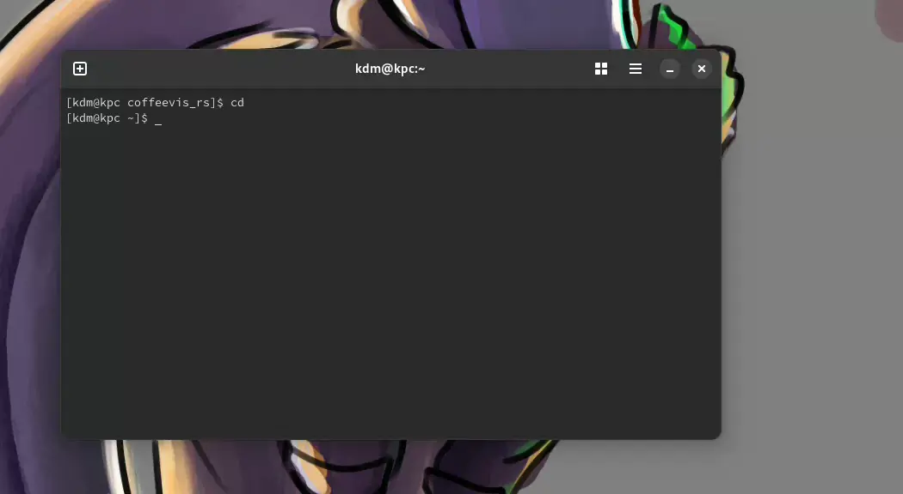
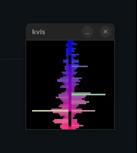

# Coffee Music Visualizer
A personal GUI + TUI music visualizer written in Rust.

## About this project
I decided to write the visualizer because existing projects didn't suit me.
Some too slow, some didn't have the visualizer I like, some take up too much cpu usage, etc.

This project also serves as my playground, so you'll see a lot of weird implementations in the source files.

## What's new in v0.6.0

New visualizers: TODO!
Configuration changes: TODO!

Users who want to see GNOME-style decorations will now have to recompile coffeevis with `--features gnome_decor`.

### Important change since v0.5.0
*Terminal and minifb mode have been moved to their own features. You'll need to
recompile with `--features terminal` and/or `--features minifb` to use them.*

## Examples:




## Platform support
Coffeevis is built for and runs on Linux.
Windows, MacOS and BSD support is not available.

## Installation
Run `cargo install coffeevis`

To run coffeevis in a terminal, use:

```cargo install coffeevis --features terminal```

If for some reason you want to use minifb, use:

```cargo install coffeevis --features minifb```

## Configuration

Coffeevis does not remember settings and does not generate config files
(feature won't be implemented unless requested).

To get around this, make a user script that runs coffeevis with flags

E.g:
```
#!/bin/bash

/path/to/coffeevis --fps 60 --no-auto-switch --size 40x40

```

## Flags
Coffeevis supports temporary options at launch

| Option | Value (example) | Description |
| ------ | ------ | ------ |
| --minifb |  | opens window with minifb (coffeevis now runs with winit by default) |
| --x11 | | runs in X11 (Wayland is the default) |
| --ascii<br />--block<br />--braille | | runs in the terminal |
| --no-auto-switch | | disables automatic visualizer switching |
| --size | 80x80 | sets resolution in window mode |
| --scale | 2 | upscales in window mode |
| --fps | 60 | sets refresh rate |
| --resizable | | allows resizing in window mode |
| --max-con-size | 50x50 | sets maximum resolution in terminal mode |
| --vis | spectrum | launches coffeevis with the specified visualizer |

## Notes

Upon launch coffeevis will grab your default audio source, use an audio
config tool to direct your desired source to coffeevis (e.g. `pavucontrol`).

On Wayland, coffeevis cannot set itself on top so you will have to rely on an external tool. For example, on KDE Plasma, you can use the window rules feature.

When input is quiet, the visualizer will try to amplify the input so that the visualizers don't become boring.

Coffeevis prints text directly to stdout, rendering may be heavy depending on your terminal.

A terminal with GPU-accelerated support is recommended (i.e Alacritty, Kitty, Wezterm, ...)

A maximum resolution is built into the console mode (default: 50x50). Coffeevis will render in the center of the screen if terminal dimensions are larger than the limit.

## Keyboard shortcuts

### Global
|  Key | Description |
| ------ | ------ |
| <kbd>Space</kbd> | iterates forward through visualizers (wraps around) |
| <kbd>b</kbd> | iterates backward (wraps around) |
| <kbd>Esc</kbd> | exits |
| <kbd>/</kbd> | resets all settings |
| <kbd>-</kbd> / <kbd>+</kbd> | decreases/increases input volume |
| <kbd>\[</kbd> / <kbd>\]</kbd> | decreases/increases spectrum roughness |
| <kbd>;</kbd> / <kbd>'</kbd> | decreases/increases amount of samples into input (works for some wave-based visualizers only) |
| <kbd>\\</bkd> | toggles auto switching (default: ON, 8 seconds) |
| <kbd>n</kbd> | switches through sets of visualizers (wraps around) |

### Terminal
|  Key | Description |
| ------ | ------ |
| <kbd>.</kbd> | toggles between ascii rendering, block rendering and braille rendering |
| <kbd>9</kbd> / <kbd>0</kbd> | decreases/increases maximum resolution |
| <kbd>7</kbd> / <kbd>8</kbd> | decreases/increases fps by 5 (default: 60) |
| <kbd>1</kbd> ... <kbd>6</kbd> | changes fps to 10 ... 60 respectively |

<sup><sub>Please don't look at my code. No I'm not hiding anything in there it's all garbage code idk how to do gpu programming so it's all cpu code uh uhhh</sub></sup>
